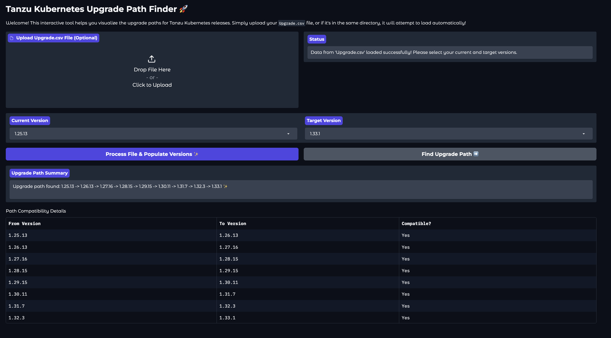

# TKR/VKR Upgrade Tool 

NOTE: This tool is not supported by VMware. Use at your own risk.
## Overview

This tool helps in managing the upgrade process for TKR ( Tanzu Kubernetes Release ) / VKR clusters by providing a user-friendly interface to visualize compatibility and upgrade paths. It provides functionalities to upload a CSV file containing version information, extract the necessary data, and generate visual representations of the upgrade path.





### Create a virtual environment and activate it
```
python -m venv venv
source venv/bin/activate
```


Links:

https://sim.esp.spespg1.vmw.saas.broadcom.com/Upgrade?productId=820&isHidePatch=true&isHideLegacyReleases=false

https://knowledge.broadcom.com/external/article/397456/the-vmware-vsphere-kubernetes-releases-v.html

https://support.broadcom.com/group/ecx/productlifecycle


https://interopmatrix.broadcom.com/Interoperability?col=820,&row=2,&isHidePatch=true&isHideGenSupported=false&isHideTechSupported=false&isHideCompatible=false&isHideNTCompatible=false&isHideIncompatible=false&isHideNotSupported=true&isCollection=false&isHideLegacyReleases=false


https://techdocs.broadcom.com/us/en/vmware-cis/vsphere/vsphere-supervisor/7-0/release-notes/vmware-tkrs-release-notes.html#GUID-db569c2a-b15e-4281-8572-ba293c831c1e-en_id-51e48565-2151-41c6-ac83-092edae888ca


